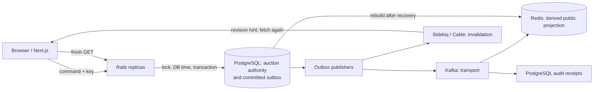

# Hammerfall

Hammerfall is an auction engineering case study about preserving one valid outcome when bids race near closing, an HTTP response disappears after commit, and downstream systems disagree after recovery. **PostgreSQL decides the auction; Rails owns the rules.** Next.js, Sidekiq, Kafka, Redis and Action Cable present or distribute committed state. The work is backed by independent PostgreSQL-session tests, local multi-replica/transport exercises and an isolated point-in-time recovery drill. It is an independent reference architecture, not a Catawiki clone or a production capacity claim.

## Why this exists

A bid changes more than a number. Current price, private maximum, reserve, ordering, deadline extension and eventual winner must agree even when requests and the closer race. A transaction protects persisted writes, but clients and derived systems can still have ambiguous or outdated knowledge. The [engineering case study](docs/case-study.md) explains the design through three failure stories and their retained evidence.

## Three hard problems

| Question | Hammerfall decision | Evidence and limit |
| --- | --- | --- |
| What if bidders contend in the final seconds? | Lock one PostgreSQL auction row; decide from fresh state and post-lock database time. | [Independent-session tests](apps/api/spec/integration/concurrent_bidding_spec.rb) and [local burst](docs/benchmarks/phase-14-session-2.md#closing-storm-and-final-ten-second-challenge). One hot auction serializes; local bursts are not capacity ratings. |
| What if a bid commits but its HTTP response is lost? | Reuse actor/key/payload; replay the stored historical outcome, then GET current state. | [Lost-response spec](apps/api/spec/requests/idempotency_spec.rb) and [A/B replica proof](docs/security/phase-20-final.md#final-verification). Replay depends on retained records and client key discipline. |
| What if recovery rewinds PostgreSQL while Kafka/Redis still show the future? | Fence writers, quarantine old broker history, rebuild derived state and replay retained outbox events. | [Isolated PITR game day](docs/operations/phase-22-final.md#integrated-local-game-day). Procedural fencing and nonzero RPO remain explicit limits. |

## Architecture



A command's price, leader, deadline, bid history, private maximum and outbox intent settle in PostgreSQL. Kafka delivery is at least once; Redis can be rebuilt; a Cable message is a cue to fetch, not a command result. The [case-study diagram and explanation](docs/case-study.md#architecture-in-one-picture) include the recovery path. [Consistency model](docs/consistency-model.md) and [ADRs](docs/adr/) define the exact boundary.

## Guarantees and evidence

The current code uses auction-local committed sequence, post-lock database time, transactional proxy resolution, explicit winner finalization, scoped command idempotency and durable outbox intent. These are bounded by the documented command paths and database constraints; they do not imply FIFO fairness, uninterrupted HTTP availability or exactly-once transport. [Invariants](docs/invariants.md) and the [claim/evidence inventory](docs/plans/phase-23-execplan.md#claim-and-evidence-inventory) give the precise proof and limits. The [Phase 21 combined scenario](docs/marketplace/phase-21-final.md#combined-scenario-and-failure-behavior) exercises stepped increments, reserve, rapid close, replica replay, Kafka/Redis and reconciliation together.

## Run locally

With Docker Engine and Compose:

```sh
test -f .env || cp .env.example .env
docker compose up --build --wait
./scripts/showcase
```

The showcase takes roughly 100 seconds on a warm stack and prints a concise result; see the [demo guide](docs/demo.md) for steps, limits and troubleshooting. Open [localhost:3000](http://localhost:3000); Rails liveness is [localhost:3001/up](http://localhost:3001/up). Port 3001 reaches a local proxy over two Rails API containers. First startup downloads dependencies. [Running locally](docs/running-locally.md) covers native setup, verification, port overrides and shutdown.

## Engineering case study and conversation

- [Case study](docs/case-study.md): three problems, decisions, experiments, actual results and limits.
- [10–15 minute walkthrough](docs/walkthrough.md), including a 60-second opening.
- [Interview guide](docs/interview-guide.md): alternatives, scale triggers and discussion prompts.
- [Catawiki public-behavior comparison](docs/catawiki-alignment.md): dated first-party sources and explicit differences. Catawiki's internal architecture is unknown here.

## Stack and scope

`apps/api` is a modular Rails application with ActiveRecord/PostgreSQL, RSpec and a closer role. `apps/web` is Next.js/TypeScript. Local Compose includes Redis/Sidekiq, Kafka publishers and consumers, two API replicas, reconciliation and optional observability. [Code map](docs/code-map.md) routes commands and tests. [Learning guide](docs/learning-guide.md) and [ADRs](docs/adr/) preserve deeper reasoning; [progress](docs/progress.md) preserves phase history.

This repository does not implement payments, bid reservations, active reserve lowering, livestream/chat, full Catawiki marketplace policy or multi-currency bidding. The [local Kubernetes exercise](docs/kubernetes/phase-18-final.md) and [Terraform/GCP reference](docs/cloud/phase-19-final.md) are locally/static-validated, without a live GCP deployment. Local load comparisons and the isolated recovery drill establish their recorded outcomes only; production capacity, Cloud SQL/managed Kafka DR, production RPO/RTO and multi-region availability remain unverified. [Production-readiness limits](docs/production-readiness.md) and the [latest handoff](docs/handoffs/latest.md) state the current verification boundary.
