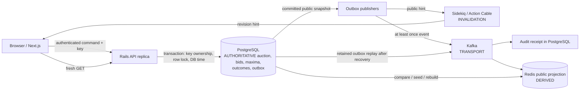

# Hammerfall: one auction truth across contention, retries and recovery

Hammerfall is a locally verified auction engineering case study. An auction can have one accepted order and winner even while requests race near closing, a client loses a successful response, and downstream systems lag or remember data later discarded by recovery. The central design is simple to state: **PostgreSQL decides the auction. Everything else distributes, presents, observes or rebuilds that decision.** Rails owns the business rules, Next.js presents public state, and transport does not decide price, deadline or winner.

This is an independent approximation of selected [public Catawiki behavior](catawiki-alignment.md), not knowledge of Catawiki's internals or a production marketplace.

## Architecture in one picture

The authoritative command path is `browser → Rails → PostgreSQL transaction`. One auction row is locked before its current state and database time are evaluated. A committed public change includes an outbox snapshot in the same transaction. Publishers and consumers run later; Kafka delivery is at least once, Redis is disposable, and Action Cable tells a browser to fetch rather than supplying auction truth. Recovery must first choose a PostgreSQL history and then make derived systems agree with it. See [consistency model](consistency-model.md), [ADR-003](adr/003-auction-concurrency-control.md), [outbox ADR](adr/010-transactional-public-outbox.md), [Kafka ADR](adr/011-kafka-domain-events.md) and [Redis ADR](adr/012-redis-public-projection.md). Kubernetes and the static GCP reference package processes; neither is a correctness authority.

## Hard problem 1: final-second concurrent bidding

**Problem.** Two requests may read the same price and deadline, while an automatic maximum, manual bid and closer contend. A transaction alone does not make a stale read/check/write safe: two individually atomic writes can accept an obsolete minimum or regress price. A browser arrival timestamp cannot decide a request that waited behind another bidder.

**Decision.** Every authoritative auction mutation locks and reloads the same PostgreSQL auction row. The command samples an uncached database `clock_timestamp()` *after* the lock, validates the fresh state, resolves any proxy contest and increment, assigns an auction-local sequence, updates price/leader/deadline and commits. The closer takes that lock and rechecks due status. Equal maximum ceilings use durable priority. The lock is the order, not a promise of FIFO request arrival. [ADR-003](adr/003-auction-concurrency-control.md), [ADR-004](adr/004-proxy-bidding.md), [ADR-005](adr/005-auction-deadlines-and-soft-close.md), [closing-policy ADR](adr/020-auction-closing-policies.md).

**Alternative.** Optimistic version/CAS could be correct if a conflict rolls back *all* generated rows and retries the entire decision from fresh state; heavy contention creates extra work and retry policy. A single-writer auction processor could change admission and ownership, but needs a durable failover/order protocol. A Ruby mutex or Redis lock cannot coordinate independent Rails writers with the existing PostgreSQL commit boundary.

**Experiment and result.** [Independent PostgreSQL-session bid tests](../apps/api/spec/integration/concurrent_bidding_spec.rb) force stale waiters, same amounts, a stepped-band crossing, deadline expiry and a close race; [maximum tests](../apps/api/spec/integration/concurrent_maximum_bidding_spec.rb) force proxy and equal-ceiling contests. [Phase 21's combined Compose run](marketplace/phase-21-final.md#combined-scenario-and-failure-behavior) produced one settled €650 leader/winner after a late rapid extension, cross-replica retry, Kafka consumption and Redis rebuild. A [local 600-bidder final-ten-second burst](benchmarks/phase-14-session-2.md#closing-storm-and-final-ten-second-challenge) recorded 1 accepted, 599 expected rejections, no HTTP errors/timeouts and a passing PostgreSQL checker; it does **not** show 600 simultaneously executing Rails commands or production capacity.

**Limit.** One hot auction serializes writers and occupies waiting connections. The local 1,000-attempt burst hit a 1,024-FD process ceiling with 28 server errors and 64 timeouts. [Profiling](benchmarks/phase-15-final.md#causal-model) found Puma backlog and CPU/admission pressure, while measured auction lock and baseline DB checkout waits were small beside the HTTP tail. No fairness, exact closer latency or unlimited throughput is claimed.

## Hard problem 2: commit succeeded, response disappeared

**Problem.** A successful database commit can be followed by a broken HTTP connection. A fresh bid key may produce another mutation; merely reading current price cannot identify the historical command outcome. The client must keep the same intention under uncertainty.

**Decision.** The browser persists one opaque key and immutable actor/operation/payload for a logical command. PostgreSQL claims `(actor, operation, key digest)` before the auction row and stores a semantic fingerprint and terminal public response with the command transaction. Current rows use versioned HMAC-SHA256 key digests; raw keys and private maxima do not appear in public snapshots. A matching retry returns the saved historical result without re-evaluating the auction; the browser then makes a fresh GET for current state. A different payload on the same key conflicts. [ADR-006](adr/006-client-command-idempotency.md), [ADR-017](adr/017-versioned-keyed-idempotency-digests.md), [browser ADR](adr/007-browser-command-intentions.md).

**Alternative.** Server-generated response-only keys are lost with the response. Deducing success from a WebSocket hint is unsound because hints can be lost/reordered and describe a revision, not this actor's result. A dedupe cache outside the PostgreSQL transaction can disagree with the bid commit.

**Experiment and result.** [Request specs](../apps/api/spec/requests/idempotency_spec.rb) replay a committed rapid extension after a simulated lost response without another extension; [independent-session specs](../apps/api/spec/integration/concurrent_idempotency_spec.rb) test concurrent ownership. The [Phase 20 real A/B replica run](security/phase-20-final.md#final-verification) checked cross-replica replay, actor isolation and same-key races, and the [Phase 21 Compose scenario](marketplace/phase-21-final.md#combined-scenario-and-failure-behavior) replayed an accepted bid through the other replica with no new extension.

**Limit.** Replay is bounded by retained records (default seven-day prune eligibility, physical deletion required before key reuse), keyring compatibility and the client preserving its key/payload. A replay is the old response, not a current auction snapshot. Unexpected database failure is allowed to fail rather than being cached as success. PITR can discard even an acknowledged command after the selected recovery point.

## Hard problem 3: derived systems remember a discarded future

**Problem.** Point-in-time recovery (PITR) rewinds PostgreSQL, not Kafka, Redis, Sidekiq or a client's memory. Replaying an old broker event from *after* the recovery target can resurrect a valid-looking higher Redis revision. A normal revision guard correctly rejects the lower restored seed, which is precisely why blind restart is unsafe.

**Decision.** Fence public traffic and every writer, quarantine the old Kafka timeline, validate restored PostgreSQL, clear the affected derived Redis namespace and seed it from authority, republish only retained outbox snapshots to a fresh broker, recreate legitimate Sidekiq work, reconcile and resume after checks. Event-ID receipts deduplicate durable audit effects; revision guards prevent older events regressing a seeded projection. [Recovery runbook](runbooks/database-recovery.md), [game-day report](operations/phase-22-final.md#integrated-local-game-day).

**Alternative.** Reconnecting the old broker or preserving an ahead Redis key would allow discarded revision 5 to survive. Idempotency cannot recreate a command excluded by PITR. Treating Sidekiq queues as a source of truth would replay work from the wrong history.

**Experiment and result.** In an isolated physical-backup/WAL drill, T1/T2/T3 were acknowledged and old Kafka/Redis reached revision 5. PITR selected a point after T2 and before T3: PostgreSQL returned to revision 4, T2 replay survived, and T3's bid/command/outbox were absent. An initial Redis seed at 4 returned `stale` against old 5. After quarantining the old broker, clearing the derived key and seeding 4, the fresh broker received only retained revisions 1–4. The audit consumer reported three duplicates and one new effect; projection replay reported three stale and one duplicate; reconciliation was healthy. The integrated local drill also verified ingress/A/B 503 fencing, queue regeneration and one fresh authenticated bid after resume. [Kafka timeline evidence](operations/phase-22-kafka-recovery.md#observed-sequence-and-evidence-index), [final game day](operations/phase-22-final.md#integrated-local-game-day), [fixture/script map](code-map.md#phase-22-recovery-and-release-exercises).

**Limit.** T3 was an acknowledged success lost by the chosen restore point: nonzero RPO. Old-broker quarantine and all-writer fencing are procedural, not automatic distributed guarantees. No Cloud SQL/managed Kafka restore, representative volume, production RPO/RTO, multi-region recovery or live GCP deployment was verified.

## Supporting propagation and failure evidence

| Question | Mechanism | Retained evidence | Result and limit |
| --- | --- | --- | --- |
| Does a committed change retain publication intent through an API crash? | Transactional PostgreSQL outbox | [Outbox invariant tests](../apps/api/spec/integration/transactional_outbox_spec.rb), [ADR-010](adr/010-transactional-public-outbox.md) | Intent shares the auction commit; later publication remains retryable and may duplicate. |
| Can a duplicate Kafka record duplicate an audit effect? | Event-ID receipt and audit write in one transaction before offset commit | [Kafka invariant matrix](invariants.md#phase-10-kafka-invariants), [recovery replay](operations/phase-22-kafka-recovery.md#observed-sequence-and-evidence-index) | Local duplicate replay made one durable effect per event ID; delivery is still at least once. |
| Can Redis be restored after loss/drift? | PostgreSQL snapshot, revision check and bounded reconciliation | [Reconciliation invariants](invariants.md#phase-12-reconciliation-invariants), [Phase 22 replay](operations/phase-22-kafka-recovery.md#observed-sequence-and-evidence-index) | Missing/older projection repaired; ahead/conflicting/corrupt state requires review or explicit recovery. |
| Does a Cable message establish a command result? | Public revision invalidation followed by REST GET | [Realtime contract](realtime.md), [browser ADR](adr/007-browser-command-intentions.md) | No. Lost hint can leave a connected view stale until its next refresh. |

## What changed my assumptions

The load runs did not justify replacing PostgreSQL locking: a short local 64-VU hot run saw about 935 ms HTTP p95 while the lock-wait p95 bucket was at most 25 ms. Later diagnostics found Puma backlog; raising threads created DB-pool waits and no repeatable end-to-end improvement. [Phase 15 review](benchmarks/phase-15-final.md). The 1,000-attempt burst found a process FD limit before any demonstrated database capacity limit. The PITR drill found that a valid revision guard cannot resolve a *timeline* mismatch by itself. These findings made admission, resource ceilings and recovery fencing more concrete than a simple “add replicas” story.

## Public marketplace relevance and real-scale decisions

[Catawiki's current public help](catawiki-alignment.md) describes stepped bids, private maxima, hidden reserve and last-moment extension. Hammerfall models selected externally visible effects through its own architecture; it does not assert Catawiki uses these mechanisms. The published [About figures](https://www.catawiki.com/en/help/about) give marketplace context only.

At larger real traffic, first measure command arrival mix per auction, queue/admission latency, database checkout and lock time, competing-auction independence, socket fanout, Kafka lag, and restore volume. Cap admitted work before blindly increasing Puma threads or connections. Independent auction rows offer natural parallelism; reads could use replicas only where their lag and consistency contract are explicit. If a few hot auctions exhaust the measured single-row budget, test a per-auction sequencer/partition or optimistic CAS with full rollback/retry and failover proof. A bidding-service extraction would need an ownership or availability reason plus one coherent price/winner ordering domain, not just a new process boundary. More consumer groups would require schema/retention governance, poison-event handling and broker DR; more WebSockets require connection/fanout measurement. Multi-region command authority introduces clock, partition and failover choices not solved here. These are hypotheses and evaluation triggers, not claims about Catawiki's current system. [Interview discussion](interview-guide.md#what-would-change-at-real-scale).

## Scope, evidence and route into code

The strongest proof is local: independent real PostgreSQL sessions, authenticated cross-replica HTTP/browser runs, real local Kafka/Redis/Compose work, bounded k6 comparisons and an isolated PITR game day. Hammerfall does **not** prove production capacity, exactly-once transport, uninterrupted service, production disaster recovery, cloud deployment, payment flows, bid reservations, full Catawiki Live, active reserve editing or multi-currency policy. [Production-readiness limits](production-readiness.md#phase-22-local-recovery-and-release-boundary), [Phase 21 scope](marketplace/phase-21-final.md#verification-and-accepted-limits).

Start a code challenge at [auction command and lock](../apps/api/app/models/auction.rb), [proxy resolver](../apps/api/app/models/bidding/proxy_resolver.rb), [idempotency executor](../apps/api/app/services/idempotency/executor.rb), or the [Phase 22 recovery script](../scripts/recovery/phase22-pitr). The [code map](code-map.md) routes exact paths; the [walkthrough](walkthrough.md) provides a 10–15 minute spoken sequence and the [interview guide](interview-guide.md) records trade-offs.
