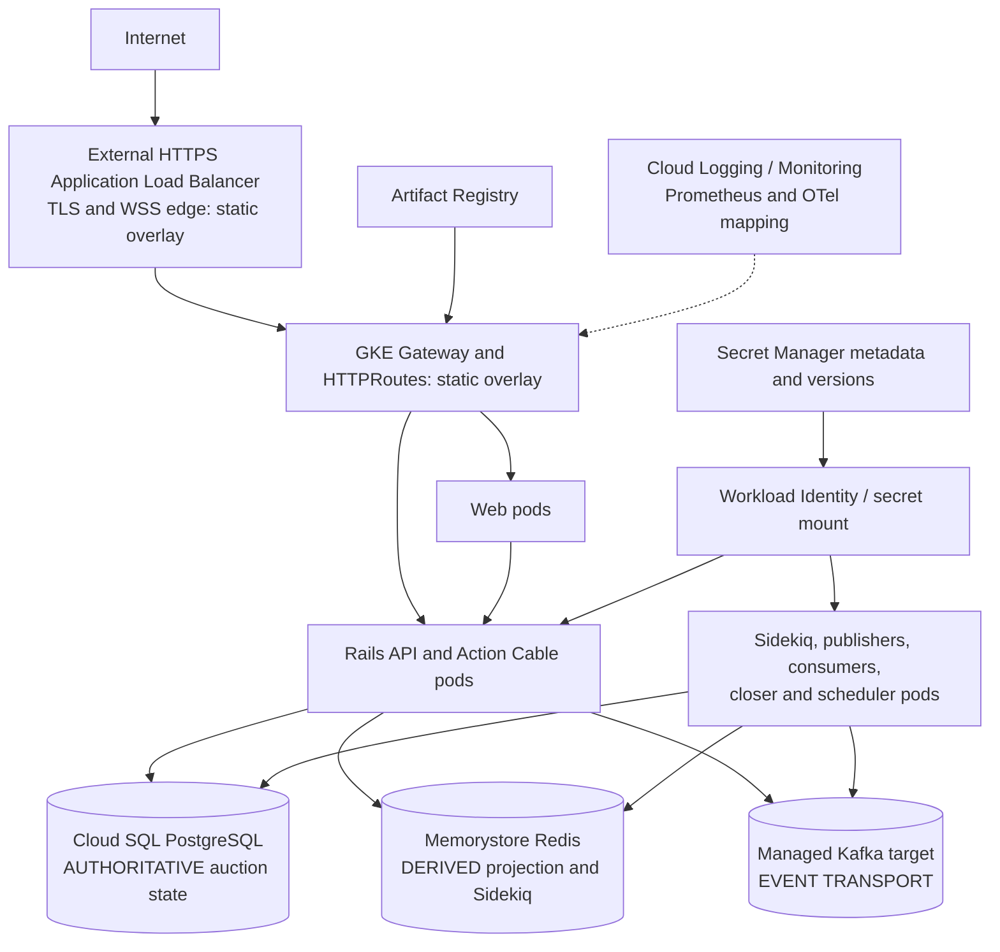

# Phase 19 GCP reference architecture

Research date: 2026-10-03. Design only; zero GCP resources created. [ADR-015](../adr/015-gcp-reference-infrastructure.md) records the adopted choices. This is Hammerfall's reference design, informed by public Catawiki stack evidence, not a description of Catawiki's internal infrastructure.

## Evidence boundary and option comparison

**Catawiki publicly confirmed:** its [engineering page](https://catawiki.careers/engineering) says it runs a Kubernetes orchestrated microservice architecture on GCP. A [platform role](https://catawiki.careers/vacancies/platform-engineer-portugal-3270914-8219279) lists Kubernetes/cloud experience and Terraform or Ansible. These do not identify GKE mode, region, stateful services, IAM or how much infrastructure is Terraform-managed.

**Hammerfall decision:** one `europe-west4` reference project, Autopilot, private Cloud SQL, private Redis, a managed-Kafka target and Google edge. Netherlands is plausible for a European demonstration and appears in the current [GKE pricing region list](https://cloud.google.com/kubernetes-engine/pricing), [Redis locations](https://docs.cloud.google.com/memorystore/docs/redis/instances), and [managed Kafka locations](https://docs.cloud.google.com/managed-service-for-apache-kafka/docs/locations). Cloud SQL is available there on its [pricing page](https://cloud.google.com/sql/pricing). This does not imply Catawiki uses the Netherlands. Another region changes service rates, latency, residency and available zones/features; re-evaluate all before use.

| Option | Architecture | Decision |
| --- | --- | --- |
| A | GKE Autopilot + Cloud SQL + Memorystore + managed Kafka | **ADOPT as reference target.** Managed nodes, native Kafka protocol and private managed state. Broker/auth and cost still gate deployment. |
| B | GKE Standard + same managed dependencies | **DEFER.** More node control/debugging and possible high-utilization savings, with node operations and whole-node billing. No observed requirement yet. |
| C | Autopilot + Cloud SQL/Redis + Pub/Sub | **REJECT as infrastructure substitution.** It needs an app migration of partition/consumer-group/offset semantics, not a Terraform flag. |

Autopilot bills general-purpose workloads by effective pod requests, may increase low requests, and manages node lifecycle. Standard bills whole nodes and gives more control over node pools. Both have a [$0.10/cluster-hour management fee](https://cloud.google.com/kubernetes-engine/pricing), subject to billing-account free credits. Background workers and long-lived Kafka consumers are ordinary pods; their correctness still comes from PostgreSQL locks, idempotency, outbox, receipts and leases. [Autopilot request rules](https://docs.cloud.google.com/kubernetes-engine/docs/concepts/autopilot-resource-requests) require validation of all Phase 18 requests before a real rollout. No HPA or PDB is claimed from the one-node local proof.

## Responsibility and traffic

The GKE process set retains two API pods, two web pods, Sidekiq, Sidekiq outbox publisher, Kafka outbox publisher, Kafka audit consumer, Kafka projection consumer, auction closer and reconciliation scheduler. A suspended `db-prepare` Job is an explicit migration step. Terraform owns GCP resources; Kubernetes manifests own workloads. The [GCP overlay](../../k8s/overlays/gcp/) removes Phase 18's local Nginx sidecar and routes `/api` and `/cable` directly to API, other paths to web, with HTTPS and HTTP redirect. API load-balancer health checks use `/ready` rather than `/up`. [External Application Load Balancers support WebSocket](https://docs.cloud.google.com/load-balancing/docs/https); global external load balancers close active WebSockets after 24 hours and idle connections after the backend timeout ([timeout guide](https://docs.cloud.google.com/load-balancing/docs/https/request-distribution)). Browser WSS fallback is same-origin. Domain, certificate map, named static IP and image digests remain explicit render inputs. No public certificate, DNS record or address was created.

## Network, authority and failure boundaries

The foundation defines one custom VPC, a `10.40.0.0/20` GKE subnet, pod and Service secondary ranges, private Google access, private GKE nodes, a narrow operator CIDR to its public control endpoint, Cloud NAT for outbound fetches, and a `10.48.0.0/16` Private Services Access allocation for Cloud SQL and Redis. There is no public database, Redis or Kafka listener in this design. Cloud NAT, public endpoint exposure and VPC firewall/network-policy behavior must be reviewed with a real project; an operator CIDR is required before enabling the reference module. [GKE private nodes](https://docs.cloud.google.com/kubernetes-engine/docs/concepts/network-isolation) need an egress path for internet-bound workloads. Managed Kafka uses private VPC subnet endpoints and DNS; it requires authenticated encrypted clients, even though its broker is private ([overview](https://docs.cloud.google.com/managed-service-for-apache-kafka/docs/overview), [networking](https://docs.cloud.google.com/managed-service-for-apache-kafka/docs/networking-kafka)).

Cloud SQL PostgreSQL 18 matches Compose's major version. Terraform sets Enterprise edition, private IP, encrypted-only connections, shared CA, automatic certificate rotation, private `sql-psa.goog` DNS, SSD, backups, PITR and both deletion protections. The default is zonal; `REGIONAL` is the HA option. [Google's certificate guidance](https://docs.cloud.google.com/sql/docs/postgres/configure-ssl-instance) requires a CA plus hostname verification with a shared CA. Rails cloud mode requires a mounted `DATABASE_URL` containing the private PSA DNS name, `sslmode=verify-full` and a readable `sslrootcert` path. A raw private IP or `sslmode=require` fails its boot guard. Direct PostgreSQL keeps a proxy sidecar and Cloud SQL IAM grant out of every pod; SQL password bootstrap remains outside Terraform. The private DNS record is modeled from provider-computed instance DNS names and IP, pending a live plan and DNS proof.

With `RAILS_MAX_THREADS=3`, the theoretical steady pool ceiling is `2 API × 3 + 7 background × 3 = 27`. Unsuspending `db-prepare` adds 3. One API surge pod adds 3; seven simultaneous one-replica Deployment surges could add 21 more: **54** during a worst-case overlapping rollout/migration. Two operator connections plus 25% headroom suggests planning for about **70** available connections before scaling. Sidekiq concurrency is 2, but its Rails pool can still reserve 3. This is a design budget, not observed Cloud SQL use; actual tier limits and rollout sequencing require validation.

Redis Basic is the cost-conscious single-zone baseline; Standard HA adds failover ([tier comparison](https://docs.cloud.google.com/memorystore/docs/redis/memorystore-for-redis-overview)). The reference instance remains `enable_redis=false`. Rails projection and Sidekiq now share a local `redis://` or explicit cloud `rediss://` configuration with a mounted CA and certificate verification. Classic Memorystore AUTH's provider-computed `auth_string` is sensitive **and stored in state when enabled**; [Sidekiq rejects Redis Cluster for its queue topology](https://github.com/sidekiq/sidekiq/wiki/Using-Redis), ruling out Cluster IAM as a drop-in replacement. The modeled classic instance uses private VPC + TLS **without Redis AUTH**. This is an accepted Phase 19 reference limitation, not a production security claim; the separate Redis gate stays off pending a security decision for any deployment. Redis loss delays Sidekiq and projections while PostgreSQL remains authoritative.

Kafka's three `rdkafka` roles now share local or Google OIDC client configuration. [Google's non-Java path](https://github.com/googleapis/managedkafka) uses a local ADC auth server; the GCP overlay places its pinned source in a loopback sidecar beside each Kafka process. `SASL_SSL`, `OAUTHBEARER`, OIDC token endpoint, broker certificate and hostname verification are explicit. Three linked Workload Identity service accounts give stable email ACL principals without JSON keys. A separately gated Terraform cluster (`enable_kafka=false`) models a three-partition topic, two consumer groups, connect IAM, idempotent-producer permission and default-deny ACL patterns. Authentication setup does not alter event identity, auction keys, manual offsets or DB-effect-before-offset behavior. Token exchange, broker connectivity, exact ACL enforcement and sidecar recovery remain live-cloud proof gaps. Pub/Sub remains a separate application migration.

| Failure domain | Designed behavior | Cloud evidence |
| --- | --- | --- |
| Pod/node | Kubernetes replaces executors; idempotent retry handles ambiguous responses | Phase 18 one-node pod proof only; no GKE/node proof |
| Zone | Regional GKE can place app pods across zones; stateful services each need their own HA | Not tested |
| GKE control plane | Existing pods may continue, but rollout/control actions may stall | Not tested |
| PostgreSQL | Authoritative commands/readiness stop; never write via Redis/Kafka fallback | Local outage evidence only |
| Redis | Queue/projection lag; normal PostgreSQL commands retain truth | Local evidence only |
| Kafka | Outbox persists publication intent; audit/projection lag | Local evidence only |
| Secret mount/start | Affected pod cannot start without its named version; existing healthy pods continue until replacement | Static CSI contract only |
| Region | This single-region design becomes unavailable; recovery is Phase 21 | Not tested |

## Identity, secrets, state and operations

| Identity | Access boundary |
| --- | --- |
| Terraform executor | Separate human/federated deployment identity; scoped provisioning permissions and GCS state access; never a pod identity. Exact custom role/grants pending real project plan. |
| Future GitHub deploy job | [OIDC to Google Workload Identity Federation](https://docs.cloud.google.com/iam/docs/workload-identity-federation-with-deployment-pipelines), separate from normal CI and Terraform identity. Release sequencing belongs to Phase 22. |
| GKE node service account | `roles/container.defaultNodeServiceAccount` at project and Artifact Registry Reader on one image repository. Image pulls are node identity, not pod WIF. |
| API/worker Kubernetes service accounts | Secret Accessor only on named database URL, secret key base, HMAC keyring and CA bundle metadata via WIF principal. No owner/editor/infra mutation. |
| Web Kubernetes service account | No GCP API role. |
| Managed Kafka clients | Separate linked GSA per publisher/audit/projection role for stable ACL email, project-scoped `roles/managedkafka.client` connect and topic/group ACLs; all gated off. |

Autopilot enables [Workload Identity Federation for GKE](https://docs.cloud.google.com/kubernetes-engine/docs/concepts/workload-identity); [GKE's managed Secret Manager add-on](https://docs.cloud.google.com/secret-manager/docs/secret-manager-managed-csi-component) mounts named secret versions read-only. Terraform creates five metadata containers (`DATABASE_URL`, `SECRET_KEY_BASE`, idempotency HMAC keyring, SQL CA bundle, Redis CA bundle) and scoped readers, but no payload or version. User-managed replication keeps payload storage in `europe-west4`; strict in-region access policy needs separate review. A separate secure bootstrap creates the SQL application user/password, puts the URL and keys into Secret Manager, and obtains CA bundles. `SecretFiles` loads mounted database/Rails secret files at boot; the idempotency keyring loader validates its separate file. The actual production boot needs `SECRET_KEY_BASE` and the HMAC keyring; no Rails credentials file currently exists. GKE KSA names must match Terraform WIF principals. Web has no secret mount or GCP API role. One project per environment bounds IAM and WIF identity overlap.

Use one [GCS backend](https://developer.hashicorp.com/terraform/language/backend/gcs) object prefix per environment after a separately bootstrapped bucket, with object versioning, uniform bucket-level access, public access prevention and narrow state IAM. GCS supports locking; bucket existence precedes backend configuration. Bootstrap has its own local state, and no bucket is created by default. State may contain sensitive resource metadata even without payloads, so restrict it. There is no implicit remote state or CI deployment.

Current structured stdout/stderr can map to Cloud Logging; current bounded Prometheus metrics and OTel can map to [Managed Service for Prometheus](https://docs.cloud.google.com/stackdriver/docs/managed-prometheus), Cloud Monitoring and a Collector while retaining Grafana/PromQL. This is an interface choice, not a telemetry migration. Exclude raw keys, private maxima, passwords and payloads; measure log/metric volume and choose retention and exclusions before enabling cloud collection. [Observability pricing](https://cloud.google.com/products/observability/pricing) is usage-dependent. Artifact Registry is regional and stores both app images; cleanup policy, scanning and immutable digest rollout remain deployment work. [Artifact Registry](https://docs.cloud.google.com/artifact-registry/docs/overview) charges for storage/egress and optional scanning.
